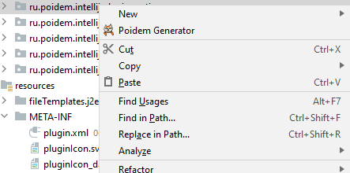
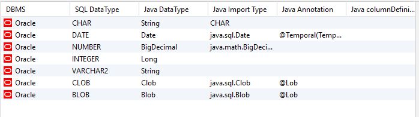

<h1>&nbsp;Poidem Generator</h1>

Generate JPA Entity Poidem from database table

## Usage

1. Right click on the table for generate a JPA Entity Poidem or a Data Transfert Object Poidem
2. Choose the path where to store the java file
3. The Java class is generated

### Options

You can change the JPA mapping and add new ones
